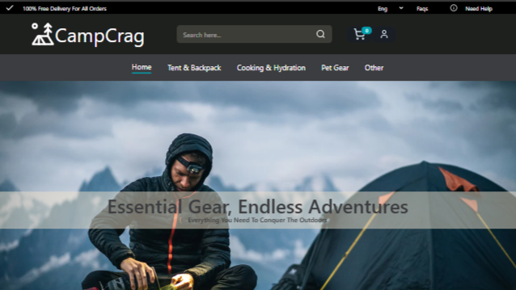
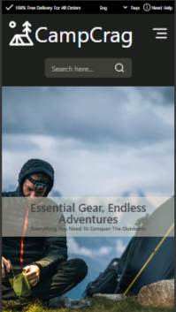
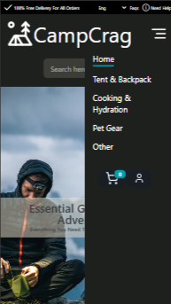

# CampCrag Ecommerce Webside
This project is an ecommerce front-end website and is for educational and portfolio purposes.
[Live Demo](https://campcrag.netlify.app/)

## Tech Stack
- tailwindcss
- daisyui
- lucide react
- reack slick
- react-toastify

## main tutorials
- [ecommerce tutorial credit1](https://www.youtube.com/watch?v=zyqkneMAnfc&t=2025s)
- [ecommerce tutorial credit2](https://www.youtube.com/watch?v=jbfuzcrfjqQ)
- [responsive tutorial credit3](https://www.youtube.com/watch?v=WbV3zRgpw_E&t=5418s)

## Navbar component
**Responsive design** with mobile support
- 
-  

**product category**
- categored by react-router-dom

**Search box** filtering products
- Built search-box using **DaisyUI**
- [search-box tutorial](https://www.youtube.com/watch?v=x7niho285qs&list=PLLFbby8jWbMc1OPwOAKwhgcqaZpVxoO_S&index=6)

**cart**
- Build with **DaisyUI**
- can view which product we add
- can delete product from cart
- have notification when user add product to cart
  - Build with **react-toastify**
  - [add to cart notification tutorial](https://www.youtube.com/watch?v=NHlExjLI-d0&t=305s)
- can see total price

**login/register
- have authentication for backend but is not functionality

## Hero component 
- [Image Slider Tutorial](https://www.youtube.com/watch?v=JuZABF3bEdg&t=256s)
- [Image Source](https://ozbackcountry.co.nz/)

## Brand component
- Brand logo slider with auto-play using **React Slick**

## Features
- Add products to cart
- Add to cart notification
- Total price calculation
- Product category pages
- Search box for filtering products
- Login / Register pages
- Fully responsive (mobile, tablet, desktop)
- Navbar Mobile Menu

## Note
> This is a frontend-only project. Backend functionality like authentication and cart persistence is not implemented.
